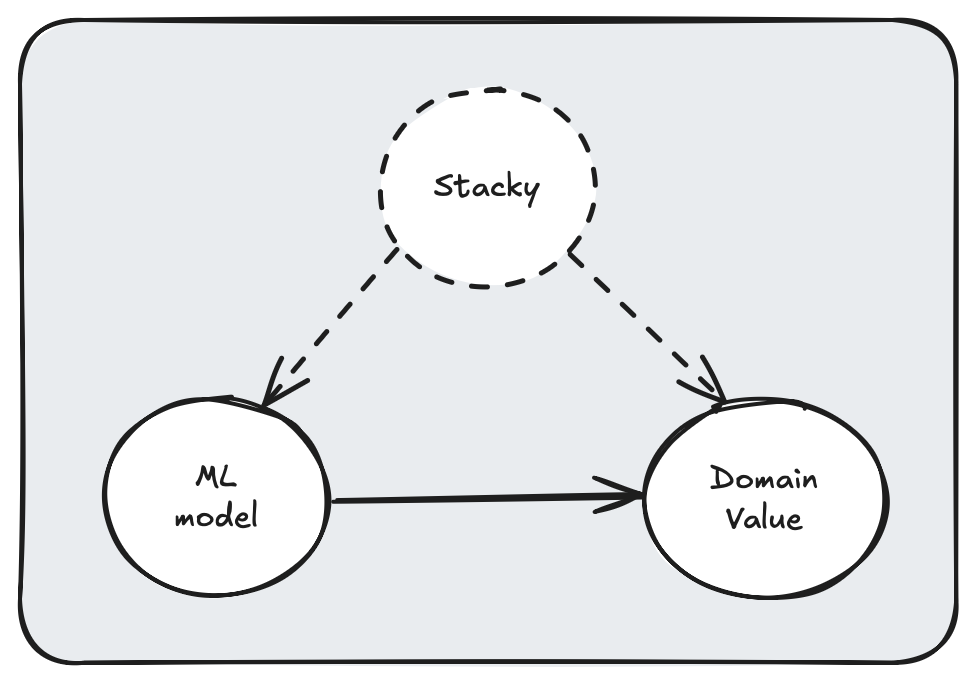

# STACKY  

Tools utilized before, during, and after the ML models creation process.

## Motivation

Machine Learning (ML) models are valuable assets across various domains. However, the processes surrounding their implementation—such as multivariate missing data imputation (before) and A/B testing (after)—are often overlooked. This repository compiles techniques that I believe can be practically useful. 

## Description (InProgress)

