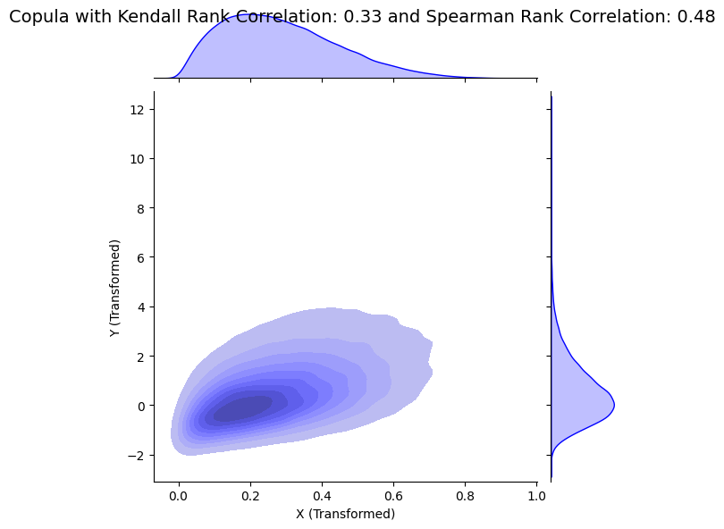

# Bivariate Analysis

## Summary 

## Polynomials

## Splines

## Gaussian Copula Generator

### Without Copula

### With Copula Modeling

### Gaussian Copula

### Gaussian Copula PDF

### Gaussian Copula CDF

