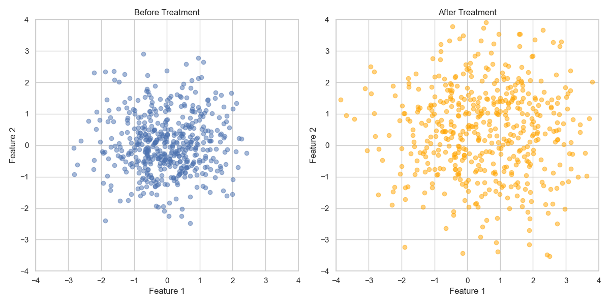
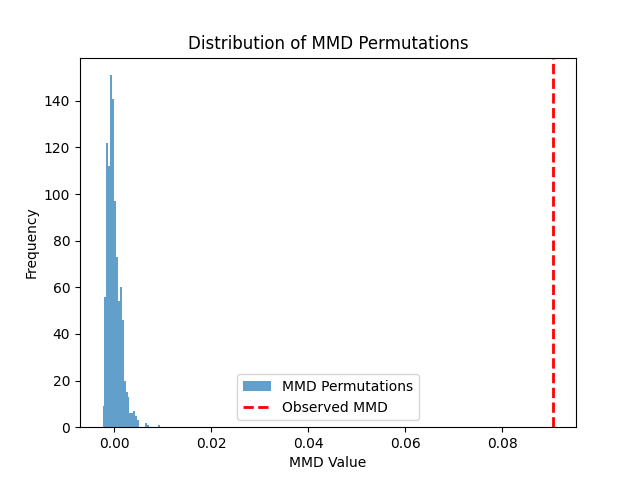

# Drift Detection
Types:
* Covariate or input drift
* Label drift
* Concept drift

## Covariate drift
* Maximum Mean Discrepancy Two-Sample Test([Paper](https://jmlr.csail.mit.edu/papers/v13/gretton12a.html)) with p-value

### Example
#### Data before and after drift

#### Statistcial significance `p_value = np.mean(mmd_perms >= mmd_obs)`
