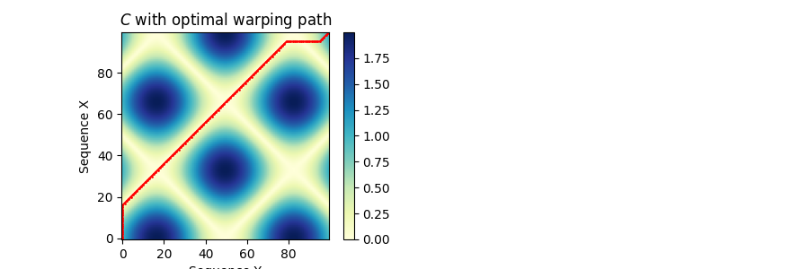
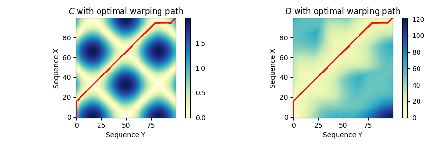
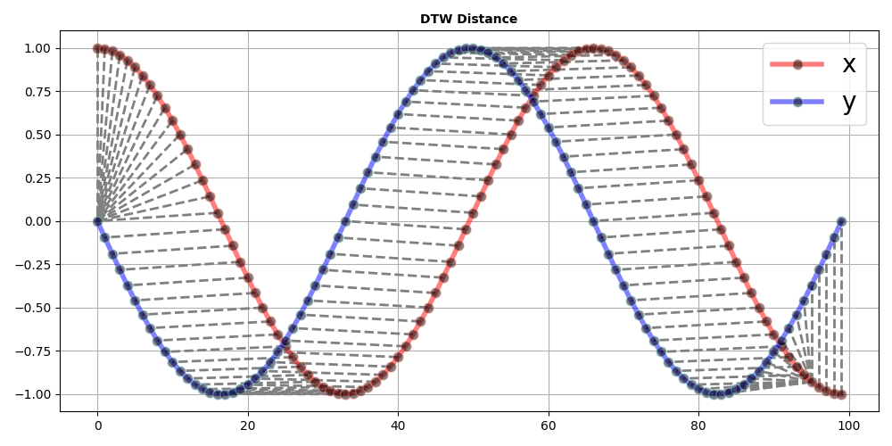

# Dynamic Time Warping

## Basic Idea
In time series analysis, dynamic time warping (DTW) is an algorithm for measuring similarity between two temporal sequences X and Y, which may vary in speed [Ref]. The objective of DTW is to temporally align these two sequences in some optimal sense under certain constraints.
* Boundary condition
* Monotonicity condition
* Step-size condition

### Cost Matrix through a Local Cost Measure

### Accumulated Cost Matrix with Dynamic Programming

### DTW Distance
